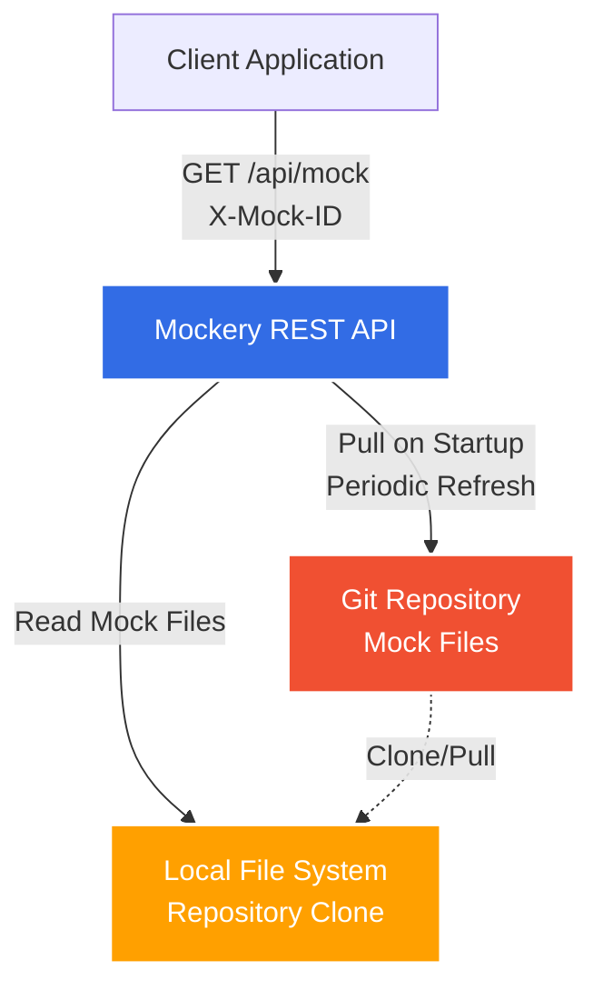
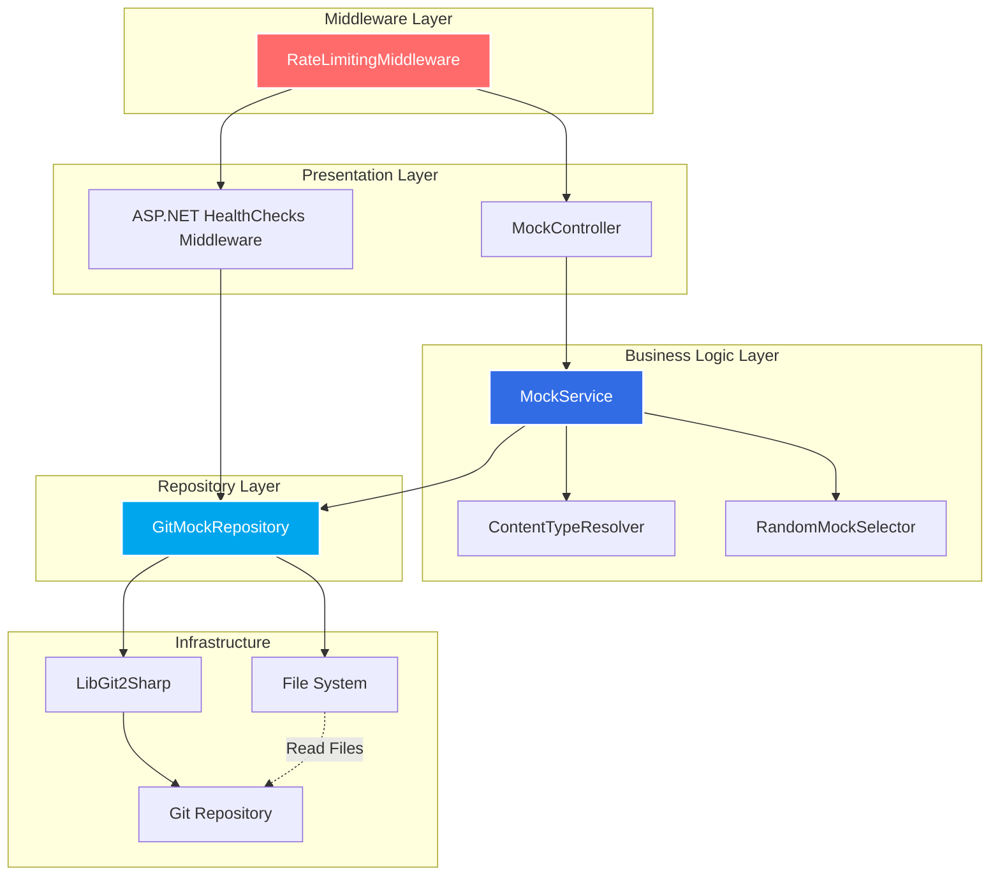
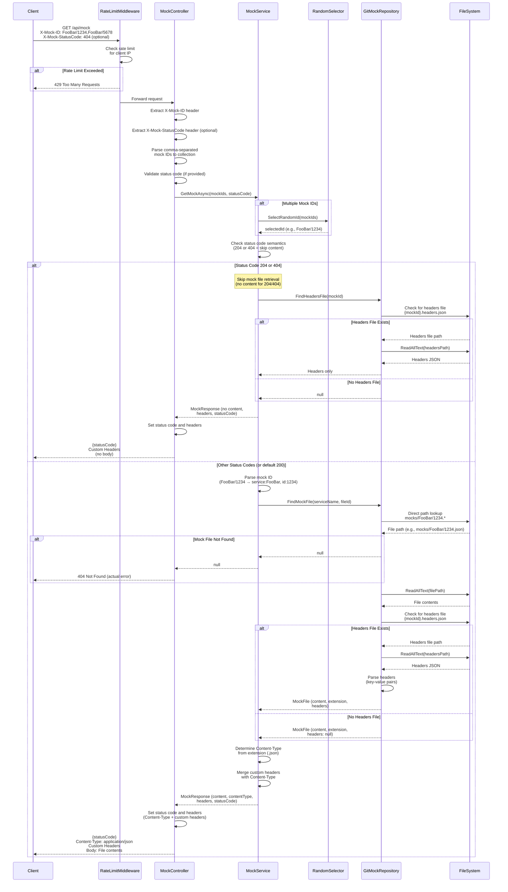
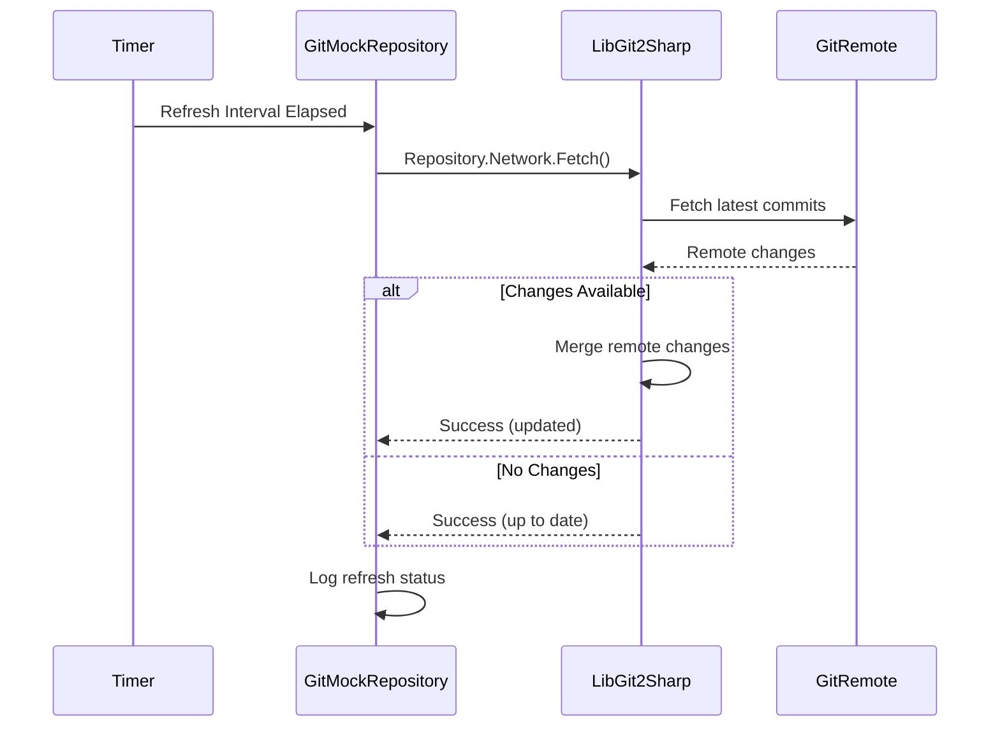
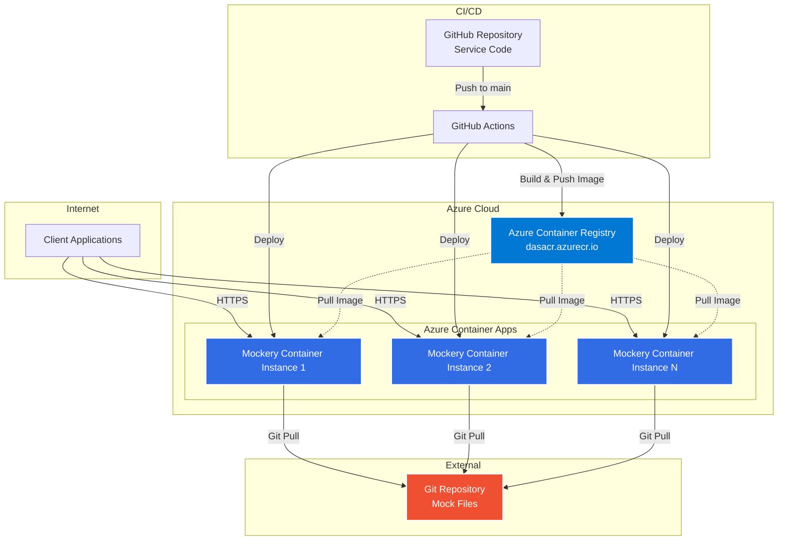
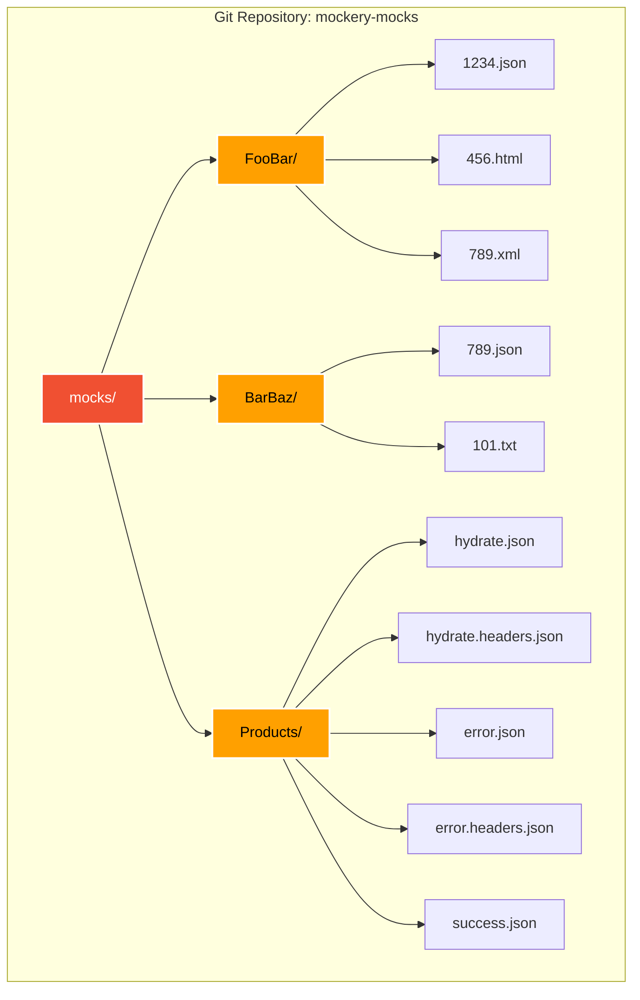

# Mockery - Technical Design Document

**Version:** 2.5
**Date:** 2025-11-15
**Author:** System Architecture Team
**Status:** Living Document

---

## Table of Contents

1. [Overview & Context](#1-overview--context)
2. [Goals & Non-Goals](#2-goals--non-goals)
3. [System Architecture](#3-system-architecture)
4. [Data Model](#4-data-model)
5. [API Design](#5-api-design)
6. [Key Technical Decisions](#6-key-technical-decisions)
7. [Dependencies](#7-dependencies)
8. [Architecture Diagrams](#8-architecture-diagrams)
9. [Cross-Cutting Concerns](#9-cross-cutting-concerns)
10. [Testing Strategy](#10-testing-strategy)
11. [CI/CD & Deployment](#11-cicd--deployment)
12. [Development Workflow](#12-development-workflow)
13. [Future Considerations](#13-future-considerations)
14. [References](#14-references)

---

## 1. Overview & Context

### 1.1 Problem Statement

Development and testing teams need a simple, reliable way to serve mock HTTP responses for:
- Testing microservices in isolation
- Simulating third-party API responses
- Creating predictable test environments
- Supporting contract testing across distributed systems

Mockery provides a Git-based mock server that:
- Stores mocks as files in a Git repository
- Provides a single HTTP endpoint for mock retrieval
- Uses file-based organization by service name
- Leverages Git for version control, history, and collaboration
- Includes built-in rate limiting to prevent abuse
- Eliminates the need for databases, authentication, and complex infrastructure

### 1.2 Business Impact

- **Developer Productivity:** Mocks managed via Git commits, pull requests, and standard development workflows
- **Simplicity:** Single API endpoint reduces cognitive overhead
- **Version Control:** Full audit trail of mock changes via Git history
- **Collaboration:** Standard Git workflows for reviewing and approving mock changes
- **Cost Efficiency:** No database infrastructure or authentication services required

### 1.3 Stakeholders

- **Development Teams:** Primary users consuming mocks for testing
- **QA Engineers:** Using mocks for integration and E2E testing
- **DevOps Engineers:** Managing deployment and infrastructure
- **Technical Leads:** Reviewing and approving mock changes via Git workflows

---

## 2. Goals & Non-Goals

### 2.1 Goals

1. **Simple Mock Retrieval**
   - Single GET endpoint with header-based mock ID selection
   - Support single mock ID or random selection from multiple IDs
   - Return raw mock content with appropriate Content-Type

2. **Git-Based Storage**
   - Organize mocks by service folders in Git repository
   - File extension determines Content-Type (.json, .html, etc.)
   - Leverage Git for version control and history

3. **Developer Experience**
   - Standard Git workflows for managing mocks
   - Pull request reviews for mock changes
   - Clear file organization by service

4. **Content-Type Support**
   - Automatic Content-Type detection from file extension
   - Support common formats (JSON, HTML, XML, plain text)

5. **Rate Limiting & Throttling**
   - Built-in middleware for dual-strategy request throttling
   - Per-IP rate limiting: Configurable limits per individual IP address
   - Global rate limiting: Configurable limits for total service capacity
   - Both strategies independently configurable via appsettings.json
   - Prevents abuse and ensures fair resource usage
   - Returns HTTP 429 (Too Many Requests) when exceeded

### 2.2 Non-Goals

1. **Authentication:** No user authentication or authorization
2. **User Management:** No user profiles, API keys, or account management
3. **Statistics:** No request counting or usage analytics
4. **CRUD Operations:** No API endpoints for creating, updating, or deleting mocks
5. **Environment Routing:** No environment-specific mock selection
6. **Probe Tracking:** No client application monitoring
7. **Complex Request Matching:** No endpoint, method, or query parameter matching
8. **Response Templating:** No dynamic response generation

---

## 3. System Architecture

### 3.1 High-Level Architecture

Mockery v2.0 follows a two-tier architecture pattern:

**Presentation Layer:**
- ASP.NET Core 9.0+ REST API with single GET endpoint
- Rate limiting middleware for request throttling
- CORS configuration for cross-origin requests
- Health check endpoint for orchestration

**Storage Layer:**
- Git repository containing mock files
- LibGit2Sharp library for Git operations
- File system access for reading mock content

### 3.2 Core Components

#### 3.2.1 Controller (`src/Mockery/Controllers/`)

| Controller | Route | Authorization | Purpose |
|------------|-------|---------------|---------|
| `MockController` | `/api/mock` | None | Retrieve mock content by mock ID(s) |

**HTTP Layer Responsibilities:**
- Extract `X-Mock-ID` header from HTTP request
- Extract `X-Mock-StatusCode` header from HTTP request (optional)
- Parse comma-separated mock IDs into collection (e.g., `"1234,5678"` → `["1234", "5678"]`)
- Parse status code from header (if present) and validate it's a valid HTTP status code
- Validate header presence and format
- Call business logic service with parsed mock IDs and optional status code as parameters
- Receive domain result from business logic (content, content-type, headers)
- Set HTTP response headers (Content-Type, custom headers)
- Set HTTP response status code (from X-Mock-StatusCode header or default 200 OK)
- Return file contents as HTTP response body (if applicable based on status code)
- Handle exceptions and return appropriate HTTP status codes (400, 404, 429, 500)

**Separation of Concerns:**
- **Does:** Parse HTTP headers, set HTTP responses, handle HTTP status codes
- **Does NOT:** Contain business logic, perform random selection, access repository directly, determine status code semantics
- **Delegates to:** `IMockService` for all business logic including status code behavior

#### 3.2.2 Business Logic (`src/Mockery/BusinessLogic/`)

**Interface:** `IMockService`

**Implementation:** `MockService`

**Key Responsibilities:**
- Accept parsed mock IDs (including service name) and optional status code as parameters (no HTTP context access)
- Random selection for multiple mock IDs
- Parse mock ID to extract service name and file ID (e.g., `FooBar/1234` → service: `FooBar`, fileId: `1234`)
- Apply status code semantics (determine if mock content should be returned)
- Locate mock file in Git repository via repository layer using direct path (if content should be returned)
- Check for optional headers file (`{ServiceName}/{MockId}.headers.json`)
- Parse headers file to extract custom HTTP headers (if present)
- Coordinate file retrieval and content-type resolution
- Return appropriate response based on status code:
  - **204 No Content:** Return no body, only headers
  - **404 Not Found:** Return no mock content, only custom headers (if headers file exists)
  - **Other 4xx/5xx codes:** Return mock content with specified status code
  - **2xx Success codes:** Return mock content normally
- Handle file not found scenarios

**Status Code Behavior Logic:**
- **204 (No Content):** Skip mock content retrieval, return headers only
- **404 (Not Found):** Skip mock content retrieval, return custom headers only (semantically "not found" = no content)
- **301/302/307/308 (Redirects):** Return mock content with redirect status (content can describe redirect)
- **Other 4xx/5xx:** Return mock content normally (content represents error message)
- **Default (no header):** Return 200 OK with mock content

**Separation of Concerns:**
- **Does NOT** parse HTTP headers or access HttpContext
- **Does NOT** interact with HTTP request/response objects
- **Receives** already-parsed mock IDs and status code from controller layer
- **Returns** domain objects (file content, content-type, headers, behavior flags) not HTTP responses

**Method Signature Example:**
```csharp
Task<MockFileResult?> GetMockAsync(IEnumerable<string> mockIds, int? statusCode = null);
```

#### 3.2.3 Repository Layer (`src/Mockery/Repository/`)

**Interface:** `IGitMockRepository`

**Implementation:** `GitMockRepository`

**Key Responsibilities:**
- Initialize Git repository connection (LibGit2Sharp)
- Locate mock files using direct path: `mocks/{ServiceName}/{FileId}.{extension}`
- Locate optional headers files using direct path: `mocks/{ServiceName}/{FileId}.headers.json`
- Read file contents from working directory
- Parse headers JSON files
- Support file extension detection (search for `{ServiceName}/{FileId}.*` to find extension)
- Handle repository refresh/pull operations

#### 3.2.4 Content-Type Resolver (`src/Mockery/Services/`)

**Class:** `ContentTypeResolver`

**Responsibilities:**
- Map file extensions to MIME types
- Support common formats:
  - `.json` → `application/json`
  - `.html` → `text/html`
  - `.xml` → `application/xml`
  - `.txt` → `text/plain`
  - `.csv` → `text/csv`
  - `.pdf` → `application/pdf`
  - Default → `application/octet-stream`

#### 3.2.5 Rate Limiting Middleware (`src/Mockery/Middleware/`)

**Class:** `RateLimitingMiddleware`

**Responsibilities:**
- Track request counts per IP address (per-IP rate limiting)
- Track global request counts across all clients (global rate limiting)
- Enforce configurable rate limits for both strategies
- Return HTTP 429 (Too Many Requests) when limit exceeded
- Support sliding window or fixed window algorithms
- Optional: Support bypass for whitelisted IPs

**Rate Limiting Strategies:**
1. **Per-IP Rate Limiting:** Limits requests per individual IP address
2. **Global Rate Limiting:** Limits total requests across all clients
3. **Combined:** Both limits can be active simultaneously (most restrictive applies)

**Configuration (appsettings.json):**
```json
{
  "RateLimiting": {
    "Enabled": true,
    "PerIp": {
      "Enabled": true,
      "PermitLimit": 100,
      "Window": "00:01:00"
    },
    "Global": {
      "Enabled": true,
      "PermitLimit": 1000,
      "Window": "00:01:00"
    },
    "QueueLimit": 0
  }
}
```

**Configuration Options:**
- `RateLimiting.Enabled`: Master switch for all rate limiting (default: true)
- `PerIp.Enabled`: Enable per-IP rate limiting (default: true)
- `PerIp.PermitLimit`: Maximum requests per IP per window (default: 100)
- `PerIp.Window`: Time window for per-IP limits (default: 1 minute)
- `Global.Enabled`: Enable global rate limiting (default: true)
- `Global.PermitLimit`: Maximum total requests per window (default: 1000)
- `Global.Window`: Time window for global limits (default: 1 minute)
- `QueueLimit`: Number of requests to queue when limit reached (default: 0)

---

## 4. Data Model

### 4.1 Storage Structure

**Git Repository Organization:**
```
mocks/
├── FooBar/
│   ├── 1234.json
│   ├── 456.html
│   └── 789.xml
├── BarBaz/
│   ├── 789.json
│   └── 101.txt
└── Products/
    ├── hydrate.json
    ├── hydrate.headers.json       # Optional headers
    ├── error.json
    ├── error.headers.json         # Optional headers
    └── success.json
```

**File Naming Convention:**
- Mock file format: `{ServiceName}/{MockId}.{extension}`
- Headers file format (optional): `{ServiceName}/{MockId}.headers.json`
- Mock ID format: `{ServiceName}/{MockId}` (e.g., `FooBar/1234`, `Products/hydrate`)
- Service name: Must match service folder name (case-sensitive)
- File ID: Numeric or alphanumeric identifier within service
- Extension: Determines Content-Type (`.json`, `.html`, `.xml`, `.txt`, etc.)

**Directory Structure:**
- Root directory: `mocks/`
- Service folders: `{ServiceName}/` (e.g., `FooBar/`, `BarBaz/`)
- Mock files: `{MockId}.{extension}` within service folders
- Metadata files (optional): `{MockId}.response.json` alongside mock files

### 4.2 File Organization

**Service Folder:**
- Represents a logical service or API
- Contains all mocks for that service
- Naming convention: PascalCase (e.g., `UserService`, `PaymentGateway`)

**Mock Files:**
- Each file contains the complete HTTP response body
- File extension determines Content-Type header
- Optional headers files for custom response headers

**Headers Files (Optional):**
- Naming: `{ServiceName}/{MockId}.headers.json` (e.g., `Products/hydrate.headers.json` for `Products/hydrate.json`)
- Contains custom HTTP response headers as key-value pairs
- If not present, response includes only Content-Type header (from file extension)
- Provides flexibility for custom headers without sacrificing simplicity

### 4.3 Example Mock Files

**FooBar/1234.json:**
```json
{
    "products": [
        {"id": 1, "name": "Widget", "price": 9.99},
        {"id": 2, "name": "Gadget", "price": 19.99}
    ]
}
```

**FooBar/456.html:**
```html
<!DOCTYPE html>
<html>
<head>
    <title>Mock Response</title>
</head>
<body>
    <h1>Mock HTML Response</h1>
    <p>This is a test response.</p>
</body>
</html>
```

**BarBaz/789.json:**
```json
{
    "status": "success",
    "message": "Operation completed successfully"
}
```

### 4.4 Headers File Examples

**Products/hydrate.headers.json:**
```json
{
    "X-Custom-Header": "CustomValue",
    "Cache-Control": "no-cache"
}
```

**Products/error.headers.json:**
```json
{
    "X-Error-Code": "PRODUCT_NOT_FOUND",
    "X-Request-ID": "12345"
}
```

**Products/api-key.headers.json:**
```json
{
    "X-API-Version": "2.0",
    "X-Rate-Limit": "1000",
    "X-Rate-Remaining": "999"
}
```

**Headers File Structure:**
- Simple key-value pairs representing HTTP header names and values
- All values must be strings
- Header names are case-insensitive (per HTTP specification)

**Behavior:**
- If headers file exists, custom headers are added to the response
- If headers file does not exist, response includes only Content-Type header (from file extension)
- Content-Type header always determined from mock file extension (cannot be overridden)
- Custom headers are added alongside Content-Type
- Response status code controlled by `X-Mock-StatusCode` request header (default: 200 OK)

### 4.5 Data Flow Contracts

**Mock Request Headers:**
```
X-Mock-ID: FooBar/1234
```
or (multiple mock IDs for random selection):
```
X-Mock-ID: FooBar/1234,FooBar/5678,Products/9012
```
with optional status code:
```
X-Mock-ID: Products/error
X-Mock-StatusCode: 404
```

**Mock Response:**
- HTTP Status: From X-Mock-StatusCode header (or default 200 OK, or 404 if mock not found)
- Content-Type: Determined from file extension (if content returned)
- Custom Headers: From .headers.json file (if exists)
- Body: Raw file contents (unless status code is 204 or 404)

---

## 5. API Design

### 5.1 Authentication

**No Authentication Required:** All endpoints are publicly accessible.

**Security Considerations:**
- Service intended for development/testing environments
- Production deployment should use network-level security (VPN, private networks)
- Built-in rate limiting prevents abuse
- Optional: Add IP whitelisting at infrastructure level

### 5.2 Endpoint Specifications

#### 5.2.1 Mock Retrieval API

**GET /api/mock**
- **Auth:** None
- **Headers:**
  - `X-Mock-ID: <service>/<mock-id>` or `X-Mock-ID: <service1>/<id1>,<service2>/<id2>` (required)
  - `X-Mock-StatusCode: <http-status-code>` (optional, e.g., `404`, `500`, `201`)
- **Response:** HTTP status code (from header or default 200) with mock file contents and custom headers (if headers file exists)
- **Content-Type:** Determined from file extension
- **Behavior:**
  - Parse `X-Mock-ID` header (required, format: `ServiceName/MockId`)
  - Parse `X-Mock-StatusCode` header (optional)
  - If single mock ID: Locate that mock file using direct path
  - If multiple mock IDs (comma-separated): Randomly select one mock ID, then locate that mock file
  - Locate mock file directly at `mocks/{ServiceName}/{MockId}.*` (no cross-folder search)
  - Check for optional headers file (`{ServiceName}/{MockId}.headers.json`)
  - Apply status code semantics:
    - **204 (No Content):** Return only custom headers, no body
    - **404 (Not Found):** Return only custom headers (if headers file exists), no mock content
    - **Other status codes:** Return mock content with specified status code
    - **No status code header:** Default to 200 OK with mock content
  - Determine Content-Type from mock file extension
  - Add custom headers from headers file (if present)
  - Return response based on status code behavior
- **Errors:**
  - `400 Bad Request`: Missing `X-Mock-ID` header or invalid `X-Mock-StatusCode` format
  - `404 Not Found`: No matching mock file found in repository (actual error, not simulated)
  - `429 Too Many Requests`: Rate limit exceeded

**Example Requests:**

*Single Mock ID (default 200 OK):*
```http
GET /api/mock HTTP/1.1
Host: mockery.example.com
X-Mock-ID: FooBar/1234
```

*Multiple Mock IDs (random selection):*
```http
GET /api/mock HTTP/1.1
Host: mockery.example.com
X-Mock-ID: FooBar/1234,FooBar/5678,Products/9012
```

*Simulate 404 Not Found:*
```http
GET /api/mock HTTP/1.1
Host: mockery.example.com
X-Mock-ID: Products/product
X-Mock-StatusCode: 404
```

*Simulate 500 Internal Server Error:*
```http
GET /api/mock HTTP/1.1
Host: mockery.example.com
X-Mock-ID: Products/error-response
X-Mock-StatusCode: 500
```

*Simulate 204 No Content:*
```http
GET /api/mock HTTP/1.1
Host: mockery.example.com
X-Mock-ID: Products/delete-success
X-Mock-StatusCode: 204
```

**Example Responses:**

*Success (JSON):*
```http
HTTP/1.1 200 OK
Content-Type: application/json

{
    "products": [
        {"id": 1, "name": "Widget", "price": 9.99}
    ]
}
```

*Success (HTML):*
```http
HTTP/1.1 200 OK
Content-Type: text/html

<!DOCTYPE html>
<html>
<head>
    <title>Mock Response</title>
</head>
<body>
    <h1>Mock HTML Response</h1>
</body>
</html>
```

*Success with Custom Headers (using headers file):*
```http
HTTP/1.1 200 OK
Content-Type: application/json
X-Custom-Header: CustomValue
Cache-Control: no-cache

{
    "products": [
        {"id": 1, "name": "Widget", "price": 9.99}
    ]
}
```

*Simulated 404 Not Found (X-Mock-StatusCode: 404):*
```http
HTTP/1.1 404 Not Found
X-Error-Code: PRODUCT_NOT_FOUND

(no body returned - 404 semantically means "not found")
```

*Simulated 500 Internal Server Error (X-Mock-StatusCode: 500):*
```http
HTTP/1.1 500 Internal Server Error
Content-Type: application/json

{
    "error": "Internal server error",
    "message": "Database connection failed",
    "code": "DB_ERROR"
}
```

*Simulated 204 No Content (X-Mock-StatusCode: 204):*
```http
HTTP/1.1 204 No Content
X-Operation-ID: delete-123

(no body returned - 204 means "no content")
```

*Simulated 201 Created (X-Mock-StatusCode: 201):*
```http
HTTP/1.1 201 Created
Content-Type: application/json
Location: /products/123

{
    "id": 123,
    "name": "New Product",
    "status": "created"
}
```

*Actual Error - Mock Not Found (mock file does not exist):*
```http
HTTP/1.1 404 Not Found
Content-Type: application/json

{
    "error": "Mock not found",
    "mockId": "9999"
}
```

*Rate Limit Exceeded (Per-IP):*
```http
HTTP/1.1 429 Too Many Requests
Content-Type: application/json
Retry-After: 60

{
    "error": "Rate limit exceeded",
    "limitType": "per-ip",
    "message": "Too many requests from this IP address. Please try again later.",
    "limit": 100,
    "retryAfter": 60
}
```

*Rate Limit Exceeded (Global):*
```http
HTTP/1.1 429 Too Many Requests
Content-Type: application/json
Retry-After: 60

{
    "error": "Rate limit exceeded",
    "limitType": "global",
    "message": "Service is currently experiencing high load. Please try again later.",
    "limit": 1000,
    "retryAfter": 60
}
```

#### 5.2.2 Health Check Endpoints (ASP.NET HealthChecks)

Mockery uses ASP.NET Core HealthChecks middleware to provide standardized health endpoints for container orchestrators and monitoring systems.

**GET /health/live**
- **Auth:** None
- **Purpose:** Liveness probe - indicates if the application is running
- **Response:** `200 OK` if application is alive, `503 Service Unavailable` if unhealthy
- **Used By:** Kubernetes liveness probe, container orchestrators
- **Checks:** Application is running and responsive

**GET /health/ready**
- **Auth:** None
- **Purpose:** Readiness probe - indicates if the application is ready to serve traffic
- **Response:** `200 OK` if ready, `503 Service Unavailable` if not ready
- **Used By:** Kubernetes readiness probe, load balancers
- **Checks:**
  - Git repository is cloned and accessible
  - File system is accessible
  - All dependencies are initialized

**GET /health/startup**
- **Auth:** None
- **Purpose:** Startup probe - indicates if the application has completed startup
- **Response:** `200 OK` if started, `503 Service Unavailable` if still starting
- **Used By:** Kubernetes startup probe (prevents premature liveness/readiness checks)
- **Checks:**
  - Initial Git repository clone completed
  - Application initialization finished

**Configuration:**
```csharp
// src/Mockery/Program.cs
builder.Services.AddHealthChecks()
    .AddCheck("live", () => HealthCheckResult.Healthy("Application is alive"))
    .AddCheck("ready", () => CheckGitRepositoryReady())
    .AddCheck("startup", () => CheckApplicationStartup());

app.MapHealthChecks("/health/live", new HealthCheckOptions
{
    Predicate = check => check.Name == "live"
});

app.MapHealthChecks("/health/ready", new HealthCheckOptions
{
    Predicate = check => check.Name == "ready"
});

app.MapHealthChecks("/health/startup", new HealthCheckOptions
{
    Predicate = check => check.Name == "startup"
});
```

**Example Responses:**

*Liveness - Healthy:*
```http
HTTP/1.1 200 OK
Content-Type: application/json

{
    "status": "Healthy"
}
```

*Readiness - Not Ready:*
```http
HTTP/1.1 503 Service Unavailable
Content-Type: application/json

{
    "status": "Unhealthy",
    "results": {
        "ready": {
            "status": "Unhealthy",
            "description": "Git repository not accessible"
        }
    }
}
```

*Startup - Starting:*
```http
HTTP/1.1 503 Service Unavailable
Content-Type: application/json

{
    "status": "Unhealthy",
    "results": {
        "startup": {
            "status": "Unhealthy",
            "description": "Git repository clone in progress"
        }
    }
}
```

---

## 6. Key Technical Decisions

### 6.1 Git Repository Over Database

**Decision:** Use Git repository for storing mock files instead of MongoDB or other database.

**Rationale:**
- **Version Control:** Full audit trail of all mock changes via Git history
- **Collaboration:** Standard pull request workflows for reviewing mock changes
- **Simplicity:** No database infrastructure, connection pooling, or schema management
- **Transparency:** Mock content visible in standard text editors and Git tools
- **Branching:** Support for feature branches, staging environments via Git branches
- **Rollback:** Easy rollback to previous mock versions via Git revert/reset
- **Developer Familiarity:** Teams already use Git daily

**Trade-offs:**
- **Query Performance:** No indexed lookups (mitigated by file system caching)
- **Concurrency:** File system locks instead of database transactions (acceptable for read-only operations)
- **Scalability:** Limited by file system performance (acceptable for testing use case)

**Implementation:**
- Use LibGit2Sharp for Git operations in C#
- Clone/pull repository on service startup
- Periodic refresh to pull latest changes
- File system search across service folders

### 6.2 File Extension for Content-Type Detection

**Decision:** Determine HTTP Content-Type header from file extension instead of metadata files or configuration.

**Rationale:**
- **Simplicity:** No separate configuration files or database records
- **Clarity:** Extension immediately indicates response format
- **Standard Practice:** Follows web server conventions (Apache, Nginx)
- **Tooling Support:** Editors provide syntax highlighting based on extension

**Supported Extensions:**
- `.json` → `application/json`
- `.html` → `text/html`
- `.xml` → `application/xml`
- `.txt` → `text/plain`
- `.csv` → `text/csv`
- `.pdf` → `application/pdf`

**Trade-offs:**
- **Limited Flexibility:** Cannot have same mock ID with different Content-Types
- **Extension Required:** All mock files must have extension

### 6.3 Optional Headers Files for Custom Response Headers

**Decision:** Support optional headers files (`{MockId}.headers.json`) alongside mock files to add custom HTTP response headers.

**Rationale:**
- **Flexibility:** Enable testing of custom headers (authentication, caching, rate limiting, etc.)
- **Simplicity Preserved:** Headers files are optional; simple mocks work without them
- **Separation of Concerns:** Response content in mock file, custom headers in separate file
- **Real-World Testing:** Simulate various HTTP headers for comprehensive testing
- **Backward Compatible:** Existing mocks without headers files continue to work with Content-Type only
- **Focused Scope:** Headers only (no status codes), keeping the feature simple

**Headers File Structure:**
```json
{
    "X-Custom-Header": "CustomValue",
    "Cache-Control": "no-cache",
    "X-API-Version": "2.0"
}
```

**Naming Convention:**
- Mock file: `Products/hydrate.json`
- Headers file: `Products/hydrate.headers.json`
- Pattern: `{MockId}.headers.json`

**Default Behavior (no headers file):**
- Status code: 200 OK (always)
- Headers: Content-Type only (determined from file extension)

**With Headers File:**
- Status code: 200 OK (always)
- Headers: Content-Type (from extension) + custom headers from headers file
- Content-Type cannot be overridden (always from mock file extension)

**Trade-offs:**
- **Additional Files:** Requires two files for mocks with custom headers
- **Consistency:** Must keep mock and headers files in sync
- **Naming Convention:** Developers must follow `.headers.json` convention
- **Status Code via Header:** Status codes controlled via `X-Mock-StatusCode` request header (not in file)

**Implementation:**
1. Locate mock file by mock ID
2. Check if corresponding `.headers.json` file exists
3. If exists, parse JSON as simple key-value pairs
4. Merge custom headers with Content-Type header
5. Return mock content with HTTP 200 OK and merged headers

### 6.4 Optional Status Code Header (X-Mock-StatusCode)

**Decision:** Support optional `X-Mock-StatusCode` request header to allow clients to specify the HTTP status code for the response dynamically.

**Rationale:**
- **Testing Flexibility:** Enable testing different status codes without creating multiple mock files
- **Reduced File Proliferation:** Single mock file can simulate success (200) or error (404, 500) based on test scenario
- **Dynamic Behavior:** Same mock ID can return different status codes based on test needs
- **Semantic Correctness:** Business logic applies status code semantics (e.g., 404 returns no content)
- **Header-Based Control:** Keeps mock files simple (content only), status code controlled via request header
- **Backward Compatible:** Optional header - existing clients continue to work with default 200 OK

**Status Code Semantics:**

The business logic applies HTTP status code semantics to determine response behavior:

| Status Code | Behavior | Mock Content Returned? | Custom Headers Returned? |
|-------------|----------|----------------------|-------------------------|
| **204** (No Content) | No content by definition | ❌ No | ✅ Yes |
| **404** (Not Found) | Not found = no content | ❌ No | ✅ Yes (if .headers.json exists) |
| **301/302/307/308** (Redirect) | Redirect response | ✅ Yes | ✅ Yes |
| **400/401/403/405** (Client Error) | Error message in body | ✅ Yes | ✅ Yes |
| **500/502/503** (Server Error) | Error message in body | ✅ Yes | ✅ Yes |
| **2xx** (Success) | Normal response | ✅ Yes | ✅ Yes |
| **Default** (no header) | Default success | ✅ Yes | ✅ Yes |

**Usage Pattern:**
```http
# Test success scenario
GET /api/mock
X-Mock-ID: Products/product-response
X-Mock-StatusCode: 200

# Test not found scenario (same mock ID)
GET /api/mock
X-Mock-ID: Products/product-response
X-Mock-StatusCode: 404

# Test server error scenario (same mock ID)
GET /api/mock
X-Mock-ID: Products/product-response
X-Mock-StatusCode: 500
```

**Trade-offs:**
- **Increased Complexity:** Business logic must handle status code semantics
- **Validation Required:** Controller must validate status code is valid HTTP status code
- **Documentation Burden:** Developers must understand which status codes return content vs. no content
- **Potential Confusion:** Difference between simulated 404 (X-Mock-StatusCode: 404) and actual 404 (mock file not found)

**Implementation:**
1. Controller parses `X-Mock-StatusCode` header (optional)
2. Controller validates status code is valid HTTP status code (100-599)
3. Controller passes status code to business logic as optional parameter
4. Business logic applies status code semantics:
   - For 204 or 404: Skip mock file content retrieval
   - For other codes: Retrieve mock file content normally
   - Always retrieve headers file (if exists)
5. Controller sets response status code and returns appropriate content

**Alternative Approaches Considered:**
- **Status code in .headers.json file:** Less flexible, requires file changes per status code
- **Separate files per status code:** File proliferation (1234-200.json, 1234-404.json, etc.)
- **Query parameter:** Less RESTful, breaks caching
- **Request body:** GET requests shouldn't have bodies

### 6.5 Random Selection from Multiple Mock IDs

**Decision:** Support comma-separated mock IDs in header with random selection.

**Rationale:**
- **Testing Variability:** Simulate different API responses in tests
- **Simplicity:** Single header instead of multiple API calls
- **Chaos Engineering:** Introduce controlled randomness

**Implementation:**
```csharp
// Parse comma-separated IDs
var mockIds = header.Split(',').Select(id => id.Trim()).ToArray();

// Random selection
if (mockIds.Length > 1)
{
    var random = new Random();
    var selectedId = mockIds[random.Next(mockIds.Length)];
    return selectedId;
}
```

**Trade-offs:**
- **Non-Deterministic:** Same request may return different responses
- **No Weighted Selection:** All mock IDs have equal probability

### 6.6 Service Folder Organization and Mock ID Format

**Decision:** Organize mocks by service folders and require service name prefix in mock IDs.

**Rationale:**
- **Explicit Addressing:** Mock ID includes service name (e.g., `FooBar/1234`), no ambiguity
- **Direct Lookup:** No cross-folder searching, direct path resolution
- **Performance:** O(1) file lookup instead of O(n) search across folders
- **Clarity:** Clear separation of mocks by service
- **Scalability:** Avoid thousands of files in single directory, avoid cross-folder searches
- **Collaboration:** Different teams can own different service folders
- **Collision Prevention:** Same file ID can exist in different services without conflict

**Mock ID Format:**
- Format: `{ServiceName}/{FileId}` (e.g., `Products/hydrate`, `FooBar/1234`)
- Service name must match folder name exactly (case-sensitive)
- File ID is unique within service (not globally)

**File Lookup Strategy:**
1. Parse mock ID to extract service name and file ID
2. Construct direct path: `mocks/{ServiceName}/{FileId}.*`
3. Search for files matching pattern to detect extension
4. Return matched file or 404 if not found

**Trade-offs:**
- **Longer Mock IDs:** Clients must include service name in every request
- **Format Validation:** Must validate mock ID format (contains `/` separator)
- **Path Separator:** Must handle path separators correctly (forward slash in header, platform-specific on disk)

### 6.7 No Authentication or Authorization

**Decision:** Remove all authentication and authorization mechanisms.

**Rationale:**
- **Simplicity:** No user management, API keys, or JWT validation
- **Testing Focus:** Service intended for development/testing environments
- **Network Security:** Infrastructure-level security (VPN, private networks) sufficient
- **Reduced Dependencies:** No Firebase, no user database

**Security Model:**
- **Network-Level:** Deploy in private networks or behind VPN
- **Infrastructure-Level:** Use Azure Front Door, API Gateway, or firewall rules
- **Optional IP Whitelisting:** Configure allowed client IPs at infrastructure level

**Trade-offs:**
- **Public Access Risk:** Mitigated by rate limiting, but infrastructure-level security still recommended
- **No User Isolation:** All clients access same mock repository

### 6.8 Built-In Rate Limiting Middleware

**Decision:** Include dual-strategy rate limiting (per-IP and global) as core middleware instead of relying on infrastructure-level throttling.

**Rationale:**
- **Abuse Prevention:** Prevent DoS attacks and resource exhaustion
- **Fair Resource Usage:** Per-IP limits ensure single client cannot monopolize service
- **Service Protection:** Global limits protect overall service capacity
- **Built-In Protection:** No dependency on external rate limiting services
- **Flexible Configuration:** Adjust rate limits per environment (dev vs. production)
- **Immediate Feedback:** Return HTTP 429 with retry-after guidance

**Implementation Strategies:**

1. **Per-IP Rate Limiting:**
   - Track request counts per IP address using in-memory cache
   - Prevents individual clients from overwhelming service
   - Configurable per-IP permit limit and time window
   - Default: 100 requests per IP per minute

2. **Global Rate Limiting:**
   - Track total request counts across all clients
   - Protects service from aggregate load
   - Configurable global permit limit and time window
   - Default: 1000 total requests per minute

3. **Combined Strategy:**
   - Both limits can be active simultaneously
   - Most restrictive limit applies (either per-IP or global)
   - Each strategy can be independently enabled/disabled

**Configuration (appsettings.json):**
```json
{
  "RateLimiting": {
    "Enabled": true,
    "PerIp": {
      "Enabled": true,
      "PermitLimit": 100,
      "Window": "00:01:00"
    },
    "Global": {
      "Enabled": true,
      "PermitLimit": 1000,
      "Window": "00:01:00"
    },
    "QueueLimit": 0
  }
}
```

**Environment-Specific Configuration:**

*Development:*
```json
{
  "RateLimiting": {
    "Enabled": true,
    "PerIp": {
      "Enabled": false
    },
    "Global": {
      "Enabled": true,
      "PermitLimit": 10000
    }
  }
}
```

*Production:*
```json
{
  "RateLimiting": {
    "Enabled": true,
    "PerIp": {
      "Enabled": true,
      "PermitLimit": 50
    },
    "Global": {
      "Enabled": true,
      "PermitLimit": 500
    }
  }
}
```

**Algorithm:**
- Sliding window for smooth rate limiting
- Return `Retry-After` header indicating when to retry

**Trade-offs:**
- **Memory Usage:** In-memory tracking requires RAM proportional to unique IPs
- **Distributed Deployments:** Rate limits per instance, not global (future: use Redis for shared counters)
- **IP Spoofing:** Per-IP limits rely on client IP address (use X-Forwarded-For in production)
- **Configuration Complexity:** Two limit types require careful tuning

### 6.9 Single GET Endpoint

**Decision:** Provide single GET endpoint instead of CRUD operations.

**Rationale:**
- **Simplicity:** One API contract to document and maintain
- **Git Workflows:** Mock management via Git commits, not API calls
- **Immutability:** Service is read-only at runtime (mocks change via deployments)
- **Clear Responsibility:** Service serves mocks; Git manages mocks

**Mock Management Workflow:**
1. Developer creates/modifies mock file locally
2. Commit changes to Git repository
3. Open pull request for review
4. Merge to main branch
5. Service automatically pulls latest changes (or redeploys)

**Trade-offs:**
- **Deployment Required:** Mock changes require Git push + service refresh/redeploy
- **No Dynamic Updates:** Cannot update mocks via API at runtime

---

## 7. Dependencies

### 7.1 External Services

| Service | Version | Purpose | Criticality |
|---------|---------|---------|-------------|
| **Git Repository** | 2.0+ | Mock file storage and version control | Critical |

**Git Repository Configuration:**
- **Repository URL:** Configured via environment variable `GIT_REPOSITORY_URL`
- **Branch:** Configured via environment variable `GIT_BRANCH` (default: `main`)
- **Authentication:** SSH key or personal access token
- **Clone Path:** Local file system path for repository clone

### 7.2 Internal Services

None (monolithic architecture)

### 7.3 Libraries and Frameworks

#### 7.3.1 NuGet Packages

| Package | Version | Purpose |
|---------|---------|---------|
| **Microsoft.AspNetCore.App** | 9.0.0+ | ASP.NET Core framework |
| **Microsoft.AspNetCore.RateLimiting** | 9.0.0+ | Built-in rate limiting middleware |
| **LibGit2Sharp** | 0.27.0+ | Git operations in C# |
| **Microsoft.Extensions.DependencyInjection** | 9.0.0+ | Dependency injection container |

**Removed Packages (from v1.0):**
- `Microsoft.AspNetCore.Authentication.JwtBearer` (authentication removed)
- `Microsoft.Azure.Cosmos` (database removed)
- `mongocsharpdriver` (database removed)
- `MongoDB.Driver` (database removed)

#### 7.3.2 Testing Frameworks

| Package | Version | Purpose |
|---------|---------|---------|
| **xUnit** | 2.4.0+ | Unit testing framework |
| **Moq** | 4.18.0+ | Mocking framework |
| **FluentAssertions** | 6.11.0+ | Assertion library |

### 7.4 Data Dependencies

**Git Repository:**
- Mock files organized by service folders
- File naming convention: `{MockId}.{extension}`
- File extensions determine Content-Type headers

---

## 8. Architecture Diagrams

### 8.1 System Context Diagram



### 8.2 Component Architecture Diagram



### 8.3 Mock Retrieval Sequence Diagram



### 8.4 Git Repository Refresh Flow



### 8.5 Deployment Architecture (Azure Container Apps)



### 8.6 File Organization Diagram



---

## 9. Cross-Cutting Concerns

### 9.1 Security

#### 9.1.1 Authentication & Authorization

**No Authentication:** Service has no built-in authentication or authorization.

**Security Model:**
- **Network-Level Security:** Deploy in private networks, behind VPN, or with IP whitelisting
- **Infrastructure-Level:** Use Azure Front Door, API Gateway, or firewall rules
- **Environment Separation:** Intended for development/testing environments, not public production

**Recommendations:**
- **Private Networks:** Deploy in Azure Virtual Network with private endpoints
- **IP Whitelisting:** Configure allowed client IP addresses at infrastructure level
- **Azure Front Door:** Use WAF (Web Application Firewall) for additional protection

**Built-In Protections:**
- **Rate Limiting:** Built-in middleware limits requests per IP to prevent abuse

#### 9.1.2 Data Protection

**Encryption:**
- **In Transit:** HTTPS required for production (enforced by Azure Container Apps)
- **At Rest:** Git repository hosted on secure platform (GitHub, Azure Repos)

**Secrets Management:**
- **Git Credentials:** Store SSH keys or access tokens in Azure Key Vault
- **Environment Variables:** Use Azure Container Apps secrets for sensitive configuration

**Input Validation:**
- **Mock ID Format:** Validate header contains alphanumeric characters only
- **Path Traversal Prevention:** Sanitize mock IDs to prevent directory traversal attacks
- **File Extension Validation:** Ensure file extension is in allowed list

#### 9.1.3 Known Security Considerations

1. **No Authentication:** Service is publicly accessible if exposed to internet
   - **Risk:** Unauthorized access to mock responses
   - **Mitigation:** Deploy in private network or behind authentication gateway

2. **Git Repository Access:** Service requires read access to Git repository
   - **Risk:** Exposure of Git credentials if container is compromised
   - **Mitigation:** Use read-only deploy keys or scoped access tokens

3. **Path Traversal:** Mock IDs could be crafted to access files outside mock directories
   - **Risk:** Unauthorized file access
   - **Mitigation:** Validate and sanitize mock IDs, restrict file search to mock directories only

4. **Rate Limiting Protection:**
   - **Dual-Strategy Protection:**
     - Per-IP limits prevent individual client abuse
     - Global limits protect overall service capacity
   - **Configurable via appsettings.json:**
     - Development: Relaxed limits (e.g., 10,000 global, per-IP disabled)
     - Production: Strict limits (e.g., 50 per-IP, 500 global)
   - **Both strategies independently configurable:**
     - Enable/disable per-IP limiting
     - Enable/disable global limiting
     - Adjust permit limits and time windows
   - **Monitoring:** Track rate limit violations by type (per-IP vs. global) for security analysis

### 9.2 Performance

#### 9.2.1 Expected Load

**Assumptions:**
- **Concurrent Users:** 100 concurrent testing environments
- **Requests per Second:** 1000 requests/second (peak)
- **Mock Files:** 1000 mock files across 50 service folders
- **Average Mock Size:** 10 KB

**Current Architecture:**
- In-memory file system caching by OS
- No application-level caching
- File system search across service folders

#### 9.2.2 Latency Requirements

| Operation | Target (p95) | Notes |
|-----------|--------------|-------|
| Mock Retrieval (single ID) | < 50ms | File system read + Content-Type detection |
| Mock Retrieval (random selection) | < 100ms | Random selection + file system read |
| Git Repository Refresh | < 5 seconds | Async operation, does not block requests |
| Service Startup (Git Clone) | < 30 seconds | One-time operation |

#### 9.2.3 Optimization Strategies

**File System Caching:**
- Operating system caches frequently accessed files in memory
- No additional caching layer required for initial implementation
- Future: Add in-memory cache for hot mocks

**File Search Optimization:**
- Search service folders in parallel
- Early exit on first match found
- Future: Build in-memory index of mock files on startup

**Git Operations:**
- Shallow clone (single branch, limited history) to reduce clone time
- Async refresh operations to avoid blocking requests
- Configurable refresh interval (default: 60 seconds)

**Random Selection:**
```csharp
// Use Random.Shared (.NET 6+) for better performance
var selectedId = mockIds[Random.Shared.Next(mockIds.Length)];
```

#### 9.2.4 Bottlenecks

**Identified Bottlenecks:**

1. **File System Search:** Searching multiple service folders for mock file
   - **Mitigation:** Build in-memory index on startup and refresh

2. **Git Pull Operations:** Pulling latest changes from remote repository
   - **Mitigation:** Async background task, does not block requests

3. **Cold Start:** Initial Git clone on service startup
   - **Mitigation:** Pre-clone repository in Docker image build step

4. **No Caching:** Every request reads from file system
   - **Mitigation:** Add in-memory cache for frequently accessed mocks (future)

### 9.3 Scalability

#### 9.3.1 Horizontal Scaling

**Current Support:**
- **Stateless API:** No in-memory session state
- **Read-Only Operations:** Multiple instances can read same Git repository clone
- **Azure Container Apps:** Auto-scaling based on HTTP traffic

**Scaling Configuration (Azure Container Apps):**
```yaml
scaleRules:
  - name: http-scaling
    http:
      concurrentRequests: 50
minReplicas: 2
maxReplicas: 10
```

**Scaling Configuration (Kubernetes):**
```yaml
spec:
  replicas: 2
  strategy:
    type: RollingUpdate
    rollingUpdate:
      maxSurge: 1
      maxUnavailable: 0
```

**Git Repository Synchronization:**
- Each container instance clones repository on startup
- Periodic refresh pulls latest changes
- No shared file system required between instances

#### 9.3.2 Vertical Scaling

**Recommended Resource Limits:**
```yaml
resources:
  requests:
    memory: "128Mi"
    cpu: "100m"
  limits:
    memory: "256Mi"
    cpu: "200m"
```

**Note:** Reduced resource requirements compared to v1.0 (no database connections)

#### 9.3.3 Storage Scaling

**Git Repository:**
- **Current:** Single Git repository for all mocks
- **Scaling:** Repository size limited by Git platform (GitHub: soft limit ~1GB, hard limit 100GB)
- **Future:** Support multiple Git repositories for different services

**Estimated Storage:**
- 1000 mock files × 10 KB average = 10 MB
- 10,000 mock files × 10 KB average = 100 MB
- Well within Git repository limits

### 9.4 Monitoring & Observability

#### 9.4.1 Health Checks

Mockery implements ASP.NET Core HealthChecks with three distinct endpoints for container orchestration and monitoring.

**Health Check Implementation:**

```csharp
// src/Mockery/Health/GitRepositoryHealthCheck.cs
public class GitRepositoryHealthCheck : IHealthCheck
{
    private readonly IGitMockRepository _repository;

    public async Task<HealthCheckResult> CheckHealthAsync(
        HealthCheckContext context,
        CancellationToken cancellationToken = default)
    {
        try
        {
            // Check if Git repository is accessible
            var isAccessible = await _repository.IsAccessibleAsync();

            return isAccessible
                ? HealthCheckResult.Healthy("Git repository is accessible")
                : HealthCheckResult.Unhealthy("Git repository not accessible");
        }
        catch (Exception ex)
        {
            return HealthCheckResult.Unhealthy(
                "Git repository health check failed",
                ex);
        }
    }
}

// src/Mockery/Health/StartupHealthCheck.cs
public class StartupHealthCheck : IHealthCheck
{
    private readonly IApplicationLifetime _lifetime;
    private bool _startupCompleted = false;

    public Task<HealthCheckResult> CheckHealthAsync(
        HealthCheckContext context,
        CancellationToken cancellationToken = default)
    {
        return _startupCompleted
            ? Task.FromResult(HealthCheckResult.Healthy("Startup completed"))
            : Task.FromResult(HealthCheckResult.Unhealthy("Startup in progress"));
    }

    public void MarkStartupComplete() => _startupCompleted = true;
}
```

**Registration (Program.cs):**
```csharp
builder.Services.AddHealthChecks()
    .AddCheck("live", () => HealthCheckResult.Healthy())
    .AddCheck<GitRepositoryHealthCheck>("ready", tags: new[] { "ready" })
    .AddCheck<StartupHealthCheck>("startup", tags: new[] { "startup" });

app.MapHealthChecks("/health/live", new HealthCheckOptions
{
    Predicate = check => check.Name == "live",
    ResponseWriter = WriteHealthCheckResponse
});

app.MapHealthChecks("/health/ready", new HealthCheckOptions
{
    Predicate = check => check.Tags.Contains("ready"),
    ResponseWriter = WriteHealthCheckResponse
});

app.MapHealthChecks("/health/startup", new HealthCheckOptions
{
    Predicate = check => check.Tags.Contains("startup"),
    ResponseWriter = WriteHealthCheckResponse
});
```

**Endpoints:**
- `GET /health/live` - Liveness probe (always returns healthy if app is running)
- `GET /health/ready` - Readiness probe (checks Git repository accessibility)
- `GET /health/startup` - Startup probe (checks if initial setup completed)

#### 9.4.2 Logging

**Logging Strategy:**
```csharp
// src/Mockery/Program.cs
builder.Services.AddLogging(logging =>
{
    logging.AddConsole();
    logging.AddDebug();
});
```

**Log Events:**
- Service startup and shutdown
- Git repository clone and refresh operations
- Mock retrieval requests (mock ID, file path, Content-Type)
- Errors (mock not found, file read errors, Git errors)

**Log Levels:**
- **Information:** Normal operations (startup, Git refresh, mock retrieval)
- **Warning:** Mock not found, Git refresh failures
- **Error:** File read errors, Git clone failures, unhandled exceptions

**Future Improvements:**
- Add structured logging (Serilog)
- Add OpenTelemetry integration
- Add Azure Application Insights

#### 9.4.3 Metrics

**Recommended Metrics:**

**Request Metrics:**
- Mock retrieval requests per second
- Mock retrieval success rate (200 OK vs. 404 Not Found)
- Mock retrieval latency (p50, p95, p99)

**Git Metrics:**
- Git refresh success rate
- Git refresh duration
- Time since last successful refresh

**File System Metrics:**
- File system read latency
- File cache hit rate (OS-level)

**Implementation Options:**
- ASP.NET Core built-in metrics (EventCounters)
- Prometheus metrics exporter
- Azure Application Insights

#### 9.4.4 Distributed Tracing

**Future Implementation:**
- Add OpenTelemetry instrumentation
- Trace request flow: Controller → Service → Repository → File System
- Correlate traces with logs

### 9.5 Error Handling

#### 9.5.1 Controller-Level Error Handling

**Standard HTTP Status Codes:**
- `200 OK`: Mock file found and returned
- `400 Bad Request`: Missing or invalid `X-Mock-ID` header
- `404 Not Found`: Mock file not found
- `429 Too Many Requests`: Rate limit exceeded
- `500 Internal Server Error`: Unhandled exception

**Error Response Format:**
```json
{
    "error": "Mock not found",
    "mockId": "9999"
}
```

**Future Improvements:**
- Add problem details (RFC 7807) responses
- Add correlation IDs for error tracking

#### 9.5.2 Business Logic Error Handling

**Pattern: Return Null on Failure**
```csharp
public async Task<MockFile?> GetMockAsync(string mockId)
{
    var mockFile = await _repository.FindMockFileAsync(mockId);
    if (mockFile == null)
    {
        _logger.LogWarning("Mock not found: {MockId}", mockId);
        return null;
    }
    return mockFile;
}
```

**Implications:**
- Controllers check for null and return 404 Not Found
- No exception throwing for expected failures

#### 9.5.3 Git Operations Error Handling

**Git Clone Failure:**
- Log error and exit application (cannot serve mocks without repository)
- Kubernetes will restart container

**Git Refresh Failure:**
- Log warning and continue serving mocks from existing clone
- Retry on next refresh interval

**File Read Failure:**
- Log error and return 500 Internal Server Error
- Include correlation ID for debugging

### 9.6 CORS Configuration

**Current Configuration:** Permissive (allows all origins, methods, headers)

```csharp
// src/Mockery/Program.cs
builder.Services.AddCors(options =>
{
    options.AddPolicy(name: "MyPolicy",
        policy =>
        {
            policy.AllowAnyHeader().AllowAnyMethod().AllowAnyOrigin();
        });
});
```

**Recommended Configuration:**
```csharp
policy.WithOrigins(
    "http://localhost:3000",      // Local development
    "https://test.example.com")   // Testing environments
    .WithMethods("GET", "OPTIONS")
    .WithHeaders("X-Mock-ID")
    .AllowCredentials();
```

**Security Note:** Permissive CORS acceptable for internal testing service, but should be restricted for production deployments.

---

## 10. Testing Strategy

### 10.1 Unit Testing

**Framework:** xUnit

**Coverage:**
- Business logic layer (`MockService`)
- Content-Type resolver (`ContentTypeResolver`)
- Random mock selector (`RandomMockSelector`)
- Git repository layer (`GitMockRepository`)

**Test Structure:**
```
src/Mockery.Test/
├── Services/
│   ├── MockServiceTests.cs
│   ├── ContentTypeResolverTests.cs
│   └── RandomMockSelectorTests.cs
├── Repository/
│   └── GitMockRepositoryTests.cs
└── Controllers/
    └── MockControllerTests.cs
```

**Mocking Strategy:**
- Use Moq to mock `IGitMockRepository`
- Use in-memory file system or test fixtures for repository tests
- Use FluentAssertions for readable assertions

**Example Test Pattern:**
```csharp
[Fact]
public async Task GetMockAsync_WhenSingleMockId_ReturnsMockFile()
{
    // Arrange
    var mockRepo = new Mock<IGitMockRepository>();
    mockRepo.Setup(x => x.FindMockFileAsync("1234"))
            .ReturnsAsync(new MockFile
            {
                Content = "{\"test\":\"data\"}",
                Extension = ".json"
            });

    var mockService = new MockService(mockRepo.Object);

    // Act
    var result = await mockService.GetMockAsync("1234");

    // Assert
    result.Should().NotBeNull();
    result.Content.Should().Contain("test");
    result.ContentType.Should().Be("application/json");
}
```

### 10.2 Integration Testing

**Recommended Tests:**

1. **Git Repository Integration:**
   - Test Git clone operation
   - Test Git pull/refresh operation
   - Test file search across service folders
   - Use temporary Git repository for testing

2. **API Integration:**
   - Test end-to-end request/response flows
   - Use WebApplicationFactory for in-process testing
   - Test single mock ID retrieval
   - Test multiple mock IDs with random selection

3. **File System Integration:**
   - Test file reading with various file types
   - Test Content-Type detection for different extensions

**Example Integration Test Structure:**
```csharp
public class MockControllerIntegrationTests : IClassFixture<WebApplicationFactory<Program>>
{
    private readonly WebApplicationFactory<Program> _factory;

    public MockControllerIntegrationTests(WebApplicationFactory<Program> factory)
    {
        _factory = factory;
    }

    [Fact]
    public async Task GetMock_WithValidMockId_Returns200()
    {
        // Arrange
        var client = _factory.CreateClient();
        client.DefaultRequestHeaders.Add("X-Mock-ID", "1234");

        // Act
        var response = await client.GetAsync("/api/mock");

        // Assert
        response.StatusCode.Should().Be(HttpStatusCode.OK);
        response.Content.Headers.ContentType.MediaType.Should().Be("application/json");
    }
}
```

### 10.3 End-to-End Testing

**Recommended Approach:**
1. Deploy to staging environment with test Git repository
2. Run automated tests against live API
3. Validate mock retrieval for various file types
4. Test Git repository refresh scenarios

### 10.4 Performance Testing

**Recommended Tests:**

1. **Load Testing:**
   - Use k6, JMeter, or Artillery
   - Simulate 100 concurrent requests
   - Measure mock retrieval latency under load

2. **File System Performance:**
   - Test with varying numbers of mock files (100, 1000, 10000)
   - Measure file search and read performance

3. **Git Refresh Performance:**
   - Test Git pull operation under load
   - Measure impact on request latency during refresh

### 10.5 Security Testing

**Recommended Tests:**

1. **Input Validation Testing:**
   - Path traversal attempts (e.g., `X-Mock-ID: ../../../etc/passwd`)
   - Invalid characters in mock IDs
   - Extremely long mock IDs

2. **Rate Limiting Testing:**
   - Simulate high-frequency requests
   - Validate infrastructure-level rate limiting

### 10.6 Test Environments

| Environment | Purpose | Data |
|-------------|---------|------|
| **Local** | Developer testing | Local Git repository clone |
| **CI/CD** | Automated test execution | In-memory Git repository or test fixtures |
| **Staging** | Pre-production validation | Test Git repository with sample mocks |
| **Production** | Live monitoring | Production Git repository |

**Test Data Management:**
- Use test Git repository with sample mocks for all file types
- Include edge cases (large files, various Content-Types)
- Maintain test repository separate from production mocks

---

## 11. CI/CD & Deployment

### 11.1 CI/CD Pipelines

#### 11.1.1 GitHub Actions Workflow

**File:** `.github/workflows/build-deploy.yml`

**Trigger:** Push to `main` branch or manual dispatch

**Jobs:**
1. **Build and Test:**
   - Checkout code
   - Restore dependencies
   - Build solution
   - Run unit tests
   - Build Docker image
   - Push to `dasacr.azurecr.io/mockery`

2. **Deploy:**
   - Azure login (service principal)
   - Deploy to Azure Container App `mockery` in resource group `mockery`
   - Validate deployment with health check

**Configuration:**
```yaml
name: build-deploy

on:
  push:
    branches: [ main ]
  workflow_dispatch:

jobs:
  build-and-deploy:
    runs-on: ubuntu-latest
    steps:
      - name: Checkout to the branch
        uses: actions/checkout@v3

      - name: Setup .NET
        uses: actions/setup-dotnet@v3
        with:
          dotnet-version: '9.0.x'

      - name: Restore dependencies
        run: dotnet restore src/Mockery/Mockery.csproj

      - name: Build
        run: dotnet build src/Mockery/Mockery.csproj -c Release --no-restore

      - name: Run tests
        run: dotnet test src/Mockery.Test/Mockery.Test.csproj --no-build --verbosity normal

      - name: Azure Login
        uses: azure/login@v1
        with:
          creds: ${{ secrets.MOCKERY_AZURE_CREDENTIALS }}

      - name: Build and push container image to registry
        uses: azure/container-apps-deploy-action@v2
        with:
          appSourcePath: ${{ github.workspace }}/src/Mockery
          registryUrl: dasacr.azurecr.io
          registryUsername: ${{ secrets.MOCKERY_REGISTRY_USERNAME }}
          registryPassword: ${{ secrets.MOCKERY_REGISTRY_PASSWORD }}
          containerAppName: mockery
          resourceGroup: mockery
          imageToBuild: dasacr.azurecr.io/mockery:${{ github.sha }}
          dockerfilePath: Dockerfile
```

**Secrets Required:**
- `MOCKERY_AZURE_CREDENTIALS`: Azure service principal credentials
- `MOCKERY_REGISTRY_USERNAME`: ACR username
- `MOCKERY_REGISTRY_PASSWORD`: ACR password

### 11.2 Container Build

**Dockerfile:** `src/Mockery/Dockerfile`

**Multi-Stage Build:**
```dockerfile
# Base image
FROM mcr.microsoft.com/dotnet/aspnet:9.0 AS base
WORKDIR /app
EXPOSE 8080
ENV ASPNETCORE_URLS=http://+:8080

# Build image
FROM mcr.microsoft.com/dotnet/sdk:9.0 AS build
WORKDIR /src
COPY ["Mockery.csproj", "."]
RUN dotnet restore "./Mockery.csproj"
COPY . .
WORKDIR "/src/."
RUN dotnet build "Mockery.csproj" -c Release -o /app/build

# Publish image
FROM build AS publish
RUN dotnet publish "Mockery.csproj" -c Release -o /app/publish /p:UseAppHost=false

# Final image
FROM base AS final
WORKDIR /app
COPY --from=publish /app/publish .

# Create directory for Git repository clone
RUN mkdir -p /app/mocks

ENTRYPOINT ["dotnet", "Mockery.dll"]
```

**Future Improvement - Pre-clone Git Repository:**
```dockerfile
# Add Git to final image
RUN apt-get update && apt-get install -y git && rm -rf /var/lib/apt/lists/*

# Pre-clone Git repository (optional)
ARG GIT_REPOSITORY_URL
ARG GIT_BRANCH=main
RUN if [ -n "$GIT_REPOSITORY_URL" ]; then \
    git clone --depth 1 --branch $GIT_BRANCH $GIT_REPOSITORY_URL /app/mocks; \
    fi
```

**Image Registries:**
- `dasacr.azurecr.io/mockery` (Azure Container Registry)
- `davhar/mockery` (Docker Hub, manual push)

### 11.3 Deployment Targets

#### 11.3.1 Azure Container Apps

**Resource Group:** `mockery`

**Container App Name:** `mockery`

**Environment Variables:**
- `ASPNETCORE_ENVIRONMENT`: `Production`
- `GIT_REPOSITORY_URL`: Git repository URL
- `GIT_BRANCH`: Branch to clone (default: `main`)
- `GIT_CLONE_PATH`: `/app/mocks`
- `GIT_ACCESS_TOKEN`: Personal access token (from secrets)
- `GIT_REFRESH_INTERVAL_SECONDS`: `60`

**Scaling Configuration:**
```yaml
scaleRules:
  - name: http-scaling
    http:
      concurrentRequests: 50
minReplicas: 2
maxReplicas: 10
```

**Secrets:**
- `git-access-token`: Git repository access token or SSH key

#### 11.3.2 Kubernetes (Development)

**Manifests:** `deployment/kubernetes/development/`

**Resources:**

1. **Secret:**
   ```yaml
   apiVersion: v1
   kind: Secret
   metadata:
     name: git-credentials
   type: Opaque
   stringData:
     access-token: <git-access-token>
   ```

2. **ConfigMap:**
   ```yaml
   apiVersion: v1
   kind: ConfigMap
   metadata:
     name: mockery-config
   data:
     GIT_REPOSITORY_URL: "https://github.com/your-org/mockery-mocks.git"
     GIT_BRANCH: "main"
     GIT_CLONE_PATH: "/app/mocks"
     GIT_REFRESH_INTERVAL_SECONDS: "60"
   ```

3. **Deployment:**
   ```yaml
   apiVersion: apps/v1
   kind: Deployment
   metadata:
     name: mockery-v2
   spec:
     replicas: 2
     strategy:
       type: RollingUpdate
       rollingUpdate:
         maxSurge: 1
         maxUnavailable: 0
     template:
       spec:
         containers:
           - name: mockery
             image: dasacr.azurecr.io/mockery:latest
             env:
               - name: ASPNETCORE_ENVIRONMENT
                 value: "Production"
               - name: GIT_ACCESS_TOKEN
                 valueFrom:
                   secretKeyRef:
                     name: git-credentials
                     key: access-token
             envFrom:
               - configMapRef:
                   name: mockery-config
             ports:
               - containerPort: 8080
             startupProbe:
               httpGet:
                 path: /health/startup
                 port: 8080
               initialDelaySeconds: 0
               periodSeconds: 5
               failureThreshold: 30
             livenessProbe:
               httpGet:
                 path: /health/live
                 port: 8080
               initialDelaySeconds: 0
               periodSeconds: 10
               failureThreshold: 3
             readinessProbe:
               httpGet:
                 path: /health/ready
                 port: 8080
               initialDelaySeconds: 0
               periodSeconds: 5
               failureThreshold: 3
   ```

4. **Service:**
   ```yaml
   apiVersion: v1
   kind: Service
   metadata:
     name: mockery
   spec:
     type: LoadBalancer
     ports:
       - port: 80
         targetPort: 8080
         protocol: TCP
     selector:
       app: mockery
   ```

#### 11.3.3 Docker Compose (Local Development)

**File:** `docker-compose.yaml`

**Services:**
```yaml
version: '3.8'

services:
  mockery:
    build:
      context: ./src/Mockery
      dockerfile: Dockerfile
    ports:
      - "8080:8080"
    environment:
      - ASPNETCORE_ENVIRONMENT=Development
      - GIT_REPOSITORY_URL=https://github.com/your-org/mockery-mocks.git
      - GIT_BRANCH=main
      - GIT_CLONE_PATH=/app/mocks
      - GIT_ACCESS_TOKEN=${GIT_ACCESS_TOKEN}
      - GIT_REFRESH_INTERVAL_SECONDS=60
    volumes:
      - mock-data:/app/mocks

volumes:
  mock-data:
```

**Usage:**
```bash
# Set Git access token
export GIT_ACCESS_TOKEN=your-token-here

# Start services
docker-compose up -d

# View logs
docker-compose logs -f mockery

# Stop services
docker-compose down
```

### 11.4 Environment Configuration

| Environment | ASPNETCORE_ENVIRONMENT | Git Repository | Git Branch |
|-------------|------------------------|----------------|------------|
| **Local** | Development | Local file system or test repo | `main` or feature branch |
| **Development (K8s)** | Development | Test repository | `develop` |
| **Staging** | Staging | Production repository | `staging` |
| **Production** | Production | Production repository | `main` |

**Configuration Management:**
- Environment variables for runtime configuration
- Kubernetes secrets for Git credentials
- ConfigMaps for non-sensitive configuration

### 11.5 Rollback Procedures

**Current Rollback Support:**
- **Azure Container Apps:** Rollback via Azure Portal (previous revisions)
- **Kubernetes:** Rollback via `kubectl rollout undo deployment/mockery-v2`
- **Docker Compose:** Redeploy previous image tag

**Git Repository Rollback:**
- Revert Git repository to previous commit
- Service will pull reverted changes on next refresh
- Or redeploy service to force immediate refresh

**Automated Rollback:**
- Add health check validation post-deployment
- Rollback if health checks fail after deployment

---

## 12. Development Workflow

### 12.1 Local Development Setup

**Prerequisites:**
- .NET 9.0 SDK or later
- Docker Desktop
- Git
- Visual Studio 2022 or VS Code

**Steps:**

1. **Clone Service Repository:**
   ```bash
   git clone https://github.com/your-org/mockery.git
   cd mockery
   ```

2. **Clone Mock Repository:**
   ```bash
   git clone https://github.com/your-org/mockery-mocks.git C:\mocks
   ```

3. **Configure Environment:**
   ```bash
   # Set environment variables (PowerShell)
   $env:ASPNETCORE_ENVIRONMENT="Development"
   $env:GIT_REPOSITORY_URL="https://github.com/your-org/mockery-mocks.git"
   $env:GIT_BRANCH="main"
   $env:GIT_CLONE_PATH="C:\mocks"
   $env:GIT_ACCESS_TOKEN="your-token-here"
   ```

4. **Run Application:**
   ```bash
   cd src/Mockery
   dotnet restore
   dotnet build
   dotnet run
   ```

5. **Test Endpoint:**
   ```bash
   # Single mock ID
   curl -H "X-Mock-ID: FooBar/1234" http://localhost:8080/api/mock

   # Multiple mock IDs (random selection)
   curl -H "X-Mock-ID: FooBar/1234,FooBar/5678,Products/9012" http://localhost:8080/api/mock

   # With status code
   curl -H "X-Mock-ID: Products/error" -H "X-Mock-StatusCode: 500" http://localhost:8080/api/mock
   ```

### 12.2 Managing Mocks

**Adding a New Mock:**

1. **Clone Mock Repository:**
   ```bash
   git clone https://github.com/your-org/mockery-mocks.git
   cd mockery-mocks
   ```

2. **Create Service Folder (if needed):**
   ```bash
   mkdir mocks/MyService
   ```

3. **Create Mock File:**
   ```bash
   # Create JSON mock
   echo '{"status":"success"}' > mocks/MyService/1234.json

   # Create HTML mock
   echo '<html><body>Test</body></html>' > mocks/MyService/5678.html
   ```

4. **Commit and Push:**
   ```bash
   git add mocks/MyService/
   git commit -m "Add mocks for MyService"
   git push origin main
   ```

5. **Service Refresh:**
   - Wait for service to pull latest changes (default: 60 seconds)
   - Or restart service to force immediate refresh

**Adding a Mock with Custom Headers:**

1. **Create Mock File:**
   ```bash
   # Create mock content file
   echo '{"status":"success","data":{"id":123}}' > mocks/Products/product.json
   ```

2. **Create Headers File:**
   ```bash
   # Create headers file with custom headers
   cat > mocks/Products/product.headers.json << 'EOF'
   {
       "X-API-Version": "2.0",
       "Cache-Control": "max-age=3600",
       "X-Rate-Limit": "1000"
   }
   EOF
   ```

3. **Commit and Push:**
   ```bash
   git add mocks/Products/product.json mocks/Products/product.headers.json
   git commit -m "Add product mock with custom headers"
   git push origin main
   ```

4. **Test:**
   ```bash
   # Request will return 200 OK with custom headers
   curl -i -H "X-Mock-ID: Products/product" http://localhost:8080/api/mock
   ```

**Updating an Existing Mock:**

1. **Edit Mock File:**
   ```bash
   code mocks/MyService/1234.json
   ```

2. **Commit and Push:**
   ```bash
   git add mocks/MyService/1234.json
   git commit -m "Update MyService mock 1234"
   git push origin main
   ```

**Deleting a Mock:**

1. **Remove Mock File:**
   ```bash
   git rm mocks/MyService/1234.json
   ```

2. **Commit and Push:**
   ```bash
   git commit -m "Remove MyService mock 1234"
   git push origin main
   ```

### 12.3 Code Organization

**Project Structure:**
```
src/
├── Mockery/
│   ├── Controllers/            # API controllers
│   │   └── MockController.cs
│   ├── Services/               # Business logic
│   │   ├── IMockService.cs
│   │   ├── MockService.cs
│   │   ├── ContentTypeResolver.cs
│   │   └── RandomMockSelector.cs
│   ├── Repository/             # Data access
│   │   ├── IGitMockRepository.cs
│   │   └── GitMockRepository.cs
│   ├── Models/                 # DTOs and models
│   │   ├── MockFile.cs
│   │   └── MockResponse.cs
│   ├── Health/                 # Health checks
│   │   ├── GitRepositoryHealthCheck.cs
│   │   └── StartupHealthCheck.cs
│   ├── Configuration/          # Configuration classes
│   │   └── GitConfiguration.cs
│   ├── Program.cs              # Application entry point
│   ├── appsettings.json        # Configuration
│   └── Dockerfile              # Container image definition
└── Mockery.Test/
    ├── Services/               # Service tests
    ├── Repository/             # Repository tests
    └── Controllers/            # Controller tests
```

**Naming Conventions:**
- **Variables:** camelCase (`mockId`, `filePath`)
- **Methods:** PascalCase (`GetMockAsync`, `FindMockFile`)
- **Classes:** PascalCase (`MockService`, `GitMockRepository`)
- **Interfaces:** I-prefix (`IMockService`, `IGitMockRepository`)

**Code Standards:**
- 4-space indentation
- Async suffix for async methods
- Nullable reference types enabled
- XML documentation comments for public APIs

### 12.4 Common Development Patterns

**Adding a New Content-Type:**

1. **Update ContentTypeResolver:**
   ```csharp
   // src/Mockery/Services/ContentTypeResolver.cs
   public string GetContentType(string extension)
   {
       return extension.ToLowerInvariant() switch
       {
           ".json" => "application/json",
           ".html" => "text/html",
           ".xml" => "application/xml",
           ".txt" => "text/plain",
           ".pdf" => "application/pdf",
           ".yaml" => "application/yaml",  // New
           ".yml" => "application/yaml",   // New
           _ => "application/octet-stream"
       };
   }
   ```

2. **Add Unit Test:**
   ```csharp
   [Fact]
   public void GetContentType_WithYamlExtension_ReturnsApplicationYaml()
   {
       // Arrange
       var resolver = new ContentTypeResolver();

       // Act
       var result = resolver.GetContentType(".yaml");

       // Assert
       result.Should().Be("application/yaml");
   }
   ```

**Adding New Configuration:**

1. **Update GitConfiguration:**
   ```csharp
   // src/Mockery/Configuration/GitConfiguration.cs
   public class GitConfiguration
   {
       public string RepositoryUrl { get; set; }
       public string Branch { get; set; } = "main";
       public string ClonePath { get; set; } = "/app/mocks";
       public string AccessToken { get; set; }
       public int RefreshIntervalSeconds { get; set; } = 60;
       public int MaxRetries { get; set; } = 3;  // New
   }
   ```

2. **Update appsettings.json:**
   ```json
   {
       "Git": {
           "RefreshIntervalSeconds": 60,
           "MaxRetries": 3
       }
   }
   ```

3. **Bind Configuration:**
   ```csharp
   // src/Mockery/Program.cs
   builder.Services.Configure<GitConfiguration>(
       builder.Configuration.GetSection("Git"));
   ```

### 12.5 Debugging

**Visual Studio:**
- Set breakpoints in controllers, services, or repository
- Use F5 to start debugging
- Use Immediate Window for runtime inspection

**VS Code:**
- Use launch.json configuration for .NET debugging
- Set breakpoints in code
- Use Debug Console for inspection

**Docker Container Debugging:**
```bash
# View logs
docker logs <container-id>

# Execute shell in container
docker exec -it <container-id> /bin/bash

# View Git repository
docker exec <container-id> ls -la /app/mocks

# View environment variables
docker exec <container-id> env
```

**Git Repository Debugging:**
```bash
# Check Git status
cd C:\mocks
git status
git log --oneline -10

# Test file search
Get-ChildItem -Recurse -Filter "1234.*"
```

---

## 13. Future Considerations

### 13.1 Technical Debt

**Known Issues:**

1. **No In-Memory Cache:**
   - **Impact:** Every request reads from file system
   - **Mitigation:** Add in-memory cache for frequently accessed mocks
   - **Effort:** Medium

2. **Sequential File Search:**
   - **Impact:** Performance degradation with many service folders
   - **Mitigation:** Build in-memory index on startup
   - **Effort:** Medium

3. **No Request Logging:**
   - **Impact:** Limited observability for debugging
   - **Mitigation:** Add structured logging for mock requests
   - **Effort:** Low

4. **Permissive CORS:**
   - **Impact:** Security vulnerability if exposed to public internet
   - **Mitigation:** Configure allowed origins
   - **Effort:** Low

5. **Git Clone on Startup:**
   - **Impact:** Slow service startup (cold start)
   - **Mitigation:** Pre-clone repository in Docker image
   - **Effort:** Low

### 13.2 Potential Improvements

**Short-Term (1-3 months):**

1. **Add In-Memory Cache:**
   - Cache frequently accessed mock files
   - Invalidate cache on Git refresh
   - Add cache hit/miss metrics

2. **Build Mock File Index:**
   - Build in-memory index of all mock files on startup
   - Refresh index on Git pull
   - Improves file search performance

3. **Add Request Logging:**
   - Log all mock retrieval requests (mock ID, file path, latency)
   - Add correlation IDs for request tracing
   - Integrate with Azure Application Insights

4. **Improve Health Checks:**
   - Add readiness probe (check Git repository accessible)
   - Add Git connectivity check
   - Add file system health check

5. **Pre-Clone Git Repository:**
   - Clone Git repository during Docker image build
   - Reduces service startup time
   - Add refresh-on-startup option

**Medium-Term (3-6 months):**

1. **Multiple Git Repositories:**
   - Support multiple Git repositories for different services
   - Configure repository mappings (service → repository URL)
   - Parallel cloning and refreshing

2. **Webhook Integration:**
   - Receive webhook notifications from Git platform (GitHub, Azure Repos)
   - Trigger immediate Git refresh on push events
   - Reduce latency for mock updates

3. **Enhanced Headers Support:**
   - Add support for response status code customization (currently all responses are 200 OK)
   - Consider adding status code to headers file or creating separate `.status.json` file
   - Balance simplicity with flexibility

4. **Advanced Content-Type Detection:**
   - Support custom Content-Type mappings
   - Support `.content-type` files alongside mocks
   - Fallback to extension-based detection

5. **Observability Improvements:**
   - Add Prometheus metrics exporter
   - Add distributed tracing (OpenTelemetry)
   - Add custom dashboards in Grafana

6. **Distributed Rate Limiting:**
   - Upgrade to Redis-based rate limiting for multi-instance deployments
   - Shared per-IP and global rate limit counters across all instances
   - Consistent rate limiting regardless of which instance handles request
   - Maintain dual-strategy approach (per-IP + global) with distributed storage

**Long-Term (6-12 months):**

1. **Mock Versioning:**
   - Support Git tags for mock versions
   - Client specifies version in header
   - Enables A/B testing and gradual rollouts

2. **Multi-Branch Support:**
   - Support multiple branches for different environments
   - Client specifies branch in header or via configuration
   - Enables feature branch testing

3. **Mock Analytics:**
   - Track mock usage patterns
   - Identify frequently accessed mocks
   - Generate usage reports

4. **Advanced Caching:**
   - Distributed cache (Redis) for multi-instance deployments
   - Cache warming on startup
   - TTL-based cache expiration

5. **Mock Validation:**
   - Validate JSON/XML syntax on Git refresh
   - Report invalid mocks
   - Prevent serving malformed responses

### 13.3 Scalability Roadmap

**Phase 1: Current (100-1000 requests/second)**
- Single Git repository
- File system caching by OS
- Built-in rate limiting (per-instance)
- Azure Container Apps with auto-scaling (2-10 instances)

**Phase 2: Growth (1000-10000 requests/second)**
- In-memory cache for hot mocks
- Mock file index for fast lookups
- Webhook-triggered Git refresh
- Distributed rate limiting (Redis-based)
- Azure Container Apps with increased scale (10-50 instances)

**Phase 3: Enterprise (10000+ requests/second)**
- Distributed cache (Redis) for multi-instance deployments
- Multiple Git repositories for service-level partitioning
- CDN integration for static mock responses
- Azure Kubernetes Service for fine-grained control

### 13.4 Integration Opportunities

**Git Platforms:**
- GitHub webhook integration
- Azure Repos webhook integration
- GitLab webhook integration

**CI/CD Tools:**
- GitHub Actions integration for mock validation
- Azure DevOps pipeline for mock deployment
- Pre-commit hooks for mock validation

**Testing Frameworks:**
- Jest/Mocha plugin for mock management
- Pytest plugin for mock management
- xUnit plugin for mock management

**Observability Platforms:**
- Azure Application Insights integration
- Datadog integration
- New Relic integration

---

## 14. References

### 14.1 Internal Documentation

- **CLAUDE.md:** Project overview and development guidance (v1.0)
- **deployment/readme.md:** Deployment instructions
- **deployment/helm/mockery-app/readme.md:** Helm chart usage

### 14.2 External Documentation

**ASP.NET Core:**
- [ASP.NET Core Documentation](https://docs.microsoft.com/en-us/aspnet/core/)
- [Health Checks in ASP.NET Core](https://docs.microsoft.com/en-us/aspnet/core/host-and-deploy/health-checks)

**LibGit2Sharp:**
- [LibGit2Sharp Documentation](https://github.com/libgit2/libgit2sharp)
- [LibGit2Sharp Wiki](https://github.com/libgit2/libgit2sharp/wiki)

**Git:**
- [Git Documentation](https://git-scm.com/doc)
- [Git Best Practices](https://git-scm.com/book/en/v2/Distributed-Git-Contributing-to-a-Project)

**Azure:**
- [Azure Container Apps](https://docs.microsoft.com/en-us/azure/container-apps/)
- [Azure Container Registry](https://docs.microsoft.com/en-us/azure/container-registry/)

**Docker & Kubernetes:**
- [Docker Documentation](https://docs.docker.com/)
- [Kubernetes Documentation](https://kubernetes.io/docs/)
- [Helm Documentation](https://helm.sh/docs/)

### 14.3 Related Design Documents

- **Mockery v1.0 Technical Design Document** (archived)

### 14.4 Contributing

**Code Reviews:**
- All changes require pull request review
- Follow C# coding conventions
- Include unit tests for new functionality

**Branching Strategy:**
- `main`: Production-ready code
- Feature branches: `feature/<feature-name>`
- Bugfix branches: `bugfix/<issue-number>`

**Commit Message Format:**
```
<type>(<scope>): <subject>

<body>

<footer>
```

**Types:** feat, fix, docs, style, refactor, test, chore

### 14.5 Mock Repository Guidelines

**Creating Mocks:**
- Use descriptive service folder names (PascalCase)
- Use numeric or alphanumeric mock IDs
- Include file extension for Content-Type detection
- Keep mock files small (< 100 KB)
- Use headers files (`.headers.json`) for custom response headers

**Headers File Guidelines:**
- Optional: Only create when you need custom response headers
- Naming: `{MockId}.headers.json` (must match mock file name)
- Format: Valid JSON with simple key-value pairs (all values must be strings)
- Keep in sync: Update headers file when updating corresponding mock
- Common use cases: Authentication headers, caching directives, API versioning, rate limiting info

**Organizing Mocks:**
- Group related mocks in same service folder
- Use consistent mock ID scheme (e.g., sequential numbers)
- Document mock purpose in pull request description
- Keep mock and headers files together

**Reviewing Mock Changes:**
- Validate JSON/XML syntax
- Ensure mock ID uniqueness within service
- Verify file extension matches content type
- Check headers file format (valid JSON with string key-value pairs)
- Verify mock and headers file names match
- Check for sensitive data in mock content

---

## Appendix A: Glossary

| Term | Definition |
|------|------------|
| **Mock** | HTTP response content stored as file in Git repository |
| **Mock ID** | Service-prefixed identifier for mock file in format `{ServiceName}/{FileId}` (e.g., `Products/hydrate`) |
| **Service Name** | Name of service folder containing the mock (e.g., `FooBar`, `Products`) |
| **File ID** | Unique identifier for mock within a service (e.g., `1234`, `hydrate`) |
| **Headers File** | Optional `.headers.json` file containing custom HTTP response headers for a mock |
| **X-Mock-ID** | Required request header containing mock ID(s) in format `ServiceName/FileId` |
| **X-Mock-StatusCode** | Optional request header specifying HTTP status code for response (default: 200) |
| **Service Folder** | Directory in Git repository containing mocks for specific service |
| **Content-Type** | HTTP header indicating media type of response, determined from file extension |
| **Git Repository** | Version-controlled storage for mock files |
| **Random Selection** | Behavior when multiple mock IDs provided, service randomly selects one |
| **Status Code Semantics** | Business logic that determines whether mock content is returned based on status code (e.g., 204/404 return no content) |
| **Direct Path Lookup** | File resolution using explicit path `mocks/{ServiceName}/{FileId}.*` without cross-folder searching |

---

## Appendix B: Migration from v1.0 to v2.0

### Breaking Changes

1. **Database Removed:** MongoDB no longer used; migrate mock data to Git repository
2. **Authentication Removed:** No Firebase JWT or API key authentication
3. **API Endpoints Changed:**
   - **Removed:** All CRUD endpoints (`POST /mockery/mocks`, `PUT /mockery/mocks/{id}`, etc.)
   - **Removed:** User profile endpoints (`/mockery/userprofiles`)
   - **Removed:** Probe endpoints (`/mockery/probes`)
   - **Changed:** Mock retrieval endpoint (`GET /mockery/mocks` → `GET /api/mock`)
4. **Request Header Changed:** `X-Mockery-Mock-Query` (JSON) → `X-Mock-ID` (simple string)
5. **Environment Routing Removed:** No environment-based mock selection
6. **Statistics Removed:** No request counting or usage analytics

### Migration Steps

**1. Export Existing Mocks from MongoDB:**
```javascript
// MongoDB query to export mocks
db.mocks.find().forEach(function(mock) {
    var serviceName = mock.host || "Unknown";
    var mockId = mock.id;
    var content = mock.mock.content;
    var extension = mock.mock.contentType === "application/json" ? ".json" : ".html";

    print("Service: " + serviceName + ", Mock ID: " + mockId + ", Extension: " + extension);
    print("Content: " + content);
});
```

**2. Create Git Repository for Mocks:**
```bash
# Create new Git repository
mkdir mockery-mocks
cd mockery-mocks
git init

# Create directory structure
mkdir -p mocks
```

**3. Organize Mocks by Service:**
```bash
# Create service folders
mkdir mocks/FooBar
mkdir mocks/BarBaz

# Create mock files
echo '{"products":[]}' > mocks/FooBar/1234.json
echo '<html><body>Test</body></html>' > mocks/FooBar/456.html
```

**4. Commit and Push:**
```bash
git add mocks/
git commit -m "Initial mock migration from v1.0"
git remote add origin https://github.com/your-org/mockery-mocks.git
git push -u origin main
```

**5. Update Client Applications:**
```http
# Old (v1.0)
GET /mockery/mocks HTTP/1.1
X-Mockery-Mock-Query: {"apiKey":"key","environment":"dev","method":"GET","endpoint":"http://localhost:8080/products","tag":"v1"}

# New (v2.0)
GET /api/mock HTTP/1.1
X-Mock-ID: 1234
```

**6. Deploy v2.0 Service:**
- Update environment variables (Git repository URL, access token)
- Deploy new container image
- Validate mock retrieval

**7. Decommission v1.0:**
- Archive MongoDB data
- Shutdown MongoDB instance
- Remove Firebase authentication
- Update documentation

---

## Appendix C: Open Questions

1. **How should mock ID collisions be handled?**
   - Current: First match found across service folders
   - Should mock IDs be globally unique?
   - Should service name be included in request header?

2. **What is the maximum mock file size?**
   - Should there be a file size limit?
   - How should large responses (>1MB) be handled?

3. **Should Git refresh be configurable per environment?**
   - Different refresh intervals for dev vs. production?
   - Webhook-based refresh vs. polling?

4. **How should Git authentication be managed?**
   - SSH keys vs. personal access tokens?
   - Should service support multiple authentication methods?

5. **Should there be a mock file naming convention?**
   - Current: `{MockId}.{extension}`
   - Alternative: `{MockId}-{description}.{extension}`?

---

**Document History:**

| Version | Date | Author | Changes |
|---------|------|--------|---------|
| 1.0 | 2025-11-15 | System Architecture Team | Initial TDD creation based on codebase analysis |
| 2.0 | 2025-11-15 | System Architecture Team | Major refactoring: Git-based storage, single endpoint, removed authentication/database/statistics |
| 2.1 | 2025-11-15 | System Architecture Team | Added built-in rate limiting middleware, removed Firebase references, updated architecture diagrams |
| 2.2 | 2025-11-15 | System Architecture Team | Removed "Previous State" and "Desired State" sections, updated to ASP.NET Core 9.0+ and .NET 9.0 SDK |
| 2.3 | 2025-11-15 | System Architecture Team | Enhanced rate limiting to support dual-strategy (per-IP and global) with independent configuration via appsettings.json |
| 2.4 | 2025-11-15 | System Architecture Team | Clarified separation of concerns: controller parses headers, business logic receives parsed parameters (no HTTP context access) |
| 2.5 | 2025-11-15 | System Architecture Team | Added optional metadata files (`.response.json`) for custom HTTP status codes and headers; removed Success Criteria and Future Considerations from Goals section |
| 2.6 | 2025-11-15 | System Architecture Team | Changed metadata approach: replaced `.response.json` with `.headers.json` for headers-only support (no status code customization); all responses return HTTP 200 OK |
| 2.7 | 2025-11-15 | System Architecture Team | Added `X-Mock-StatusCode` request header for dynamic status code control; business logic applies status code semantics (204/404 return no content, other codes return mock content) |
| 2.8 | 2025-11-15 | System Architecture Team | Updated mock ID format to include service name prefix (`ServiceName/FileId`); changed from cross-folder search to direct path lookup for O(1) performance |
| 2.9 | 2025-11-15 | System Architecture Team | Replaced simple health check with ASP.NET Core HealthChecks; added three endpoints: `/health/live` (liveness), `/health/ready` (readiness), `/health/startup` (startup probe) |
| 3.0 | 2025-11-15 | System Architecture Team | Removed section 7.4 Infrastructure (Azure Services, Container Orchestration, Git Repository Configuration); simplified dependencies section |

---

**Approvals:**

| Role | Name | Date | Signature |
|------|------|------|-----------|
| Technical Lead | _______________ | _______ | _______________ |
| Security Architect | _______________ | _______ | _______________ |
| DevOps Lead | _______________ | _______ | _______________ |
